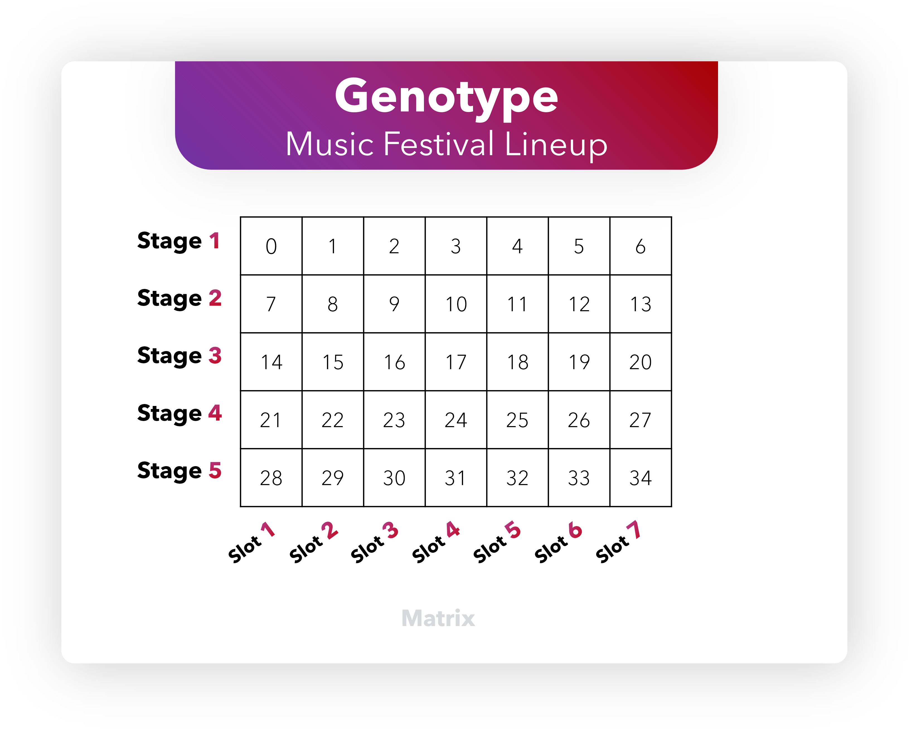
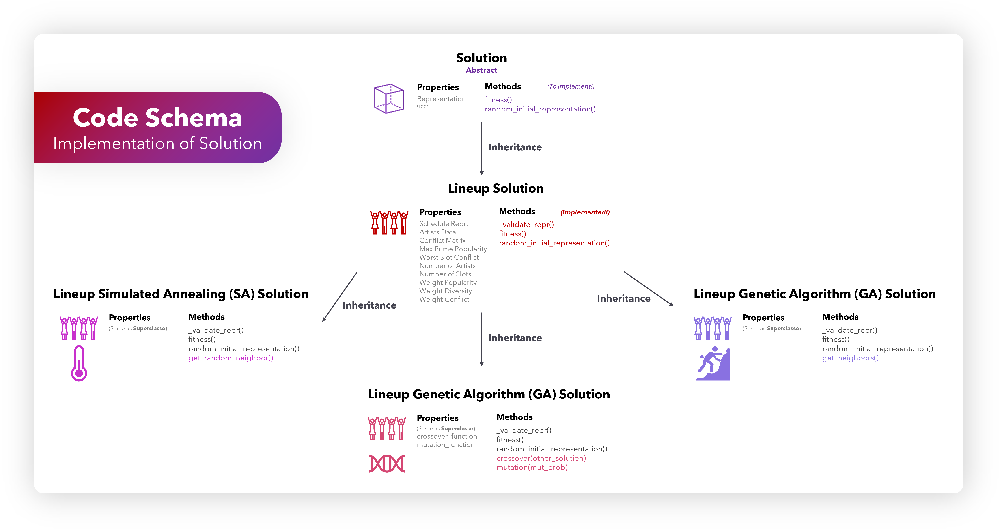
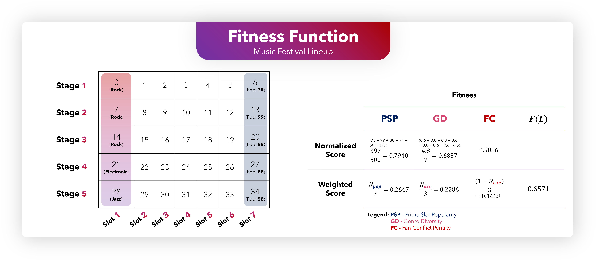
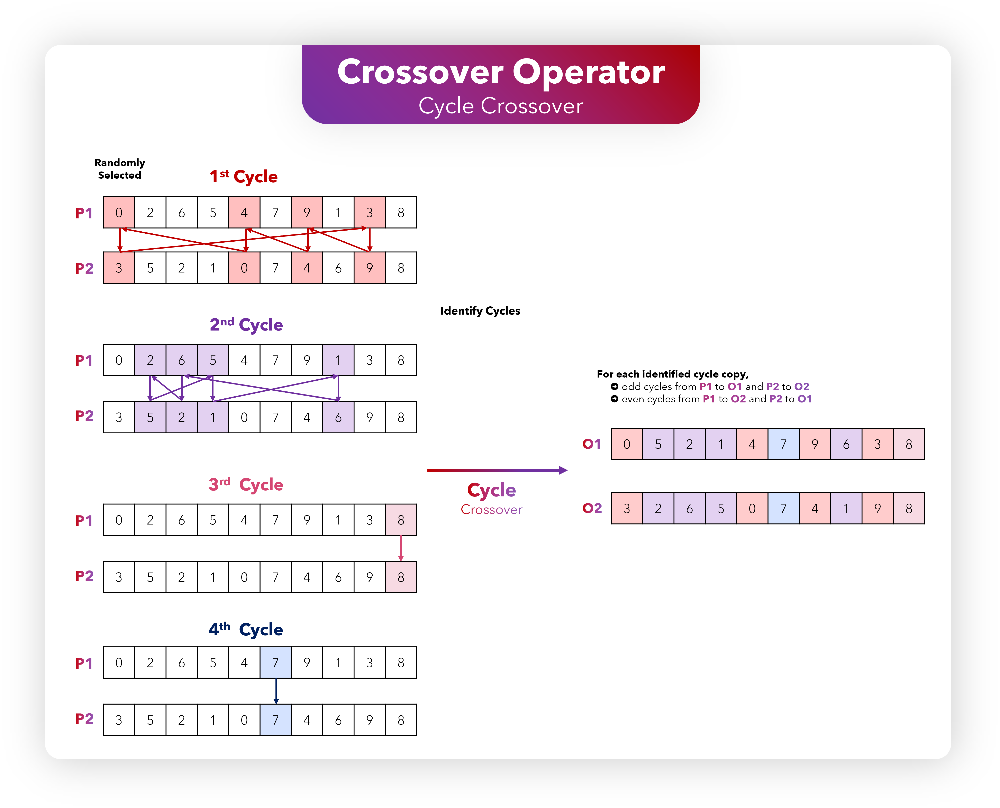
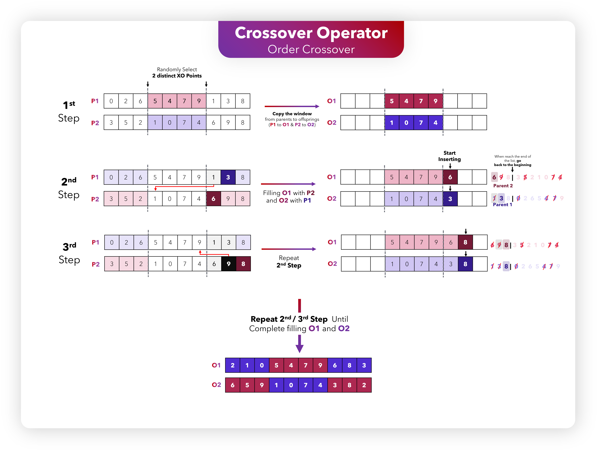
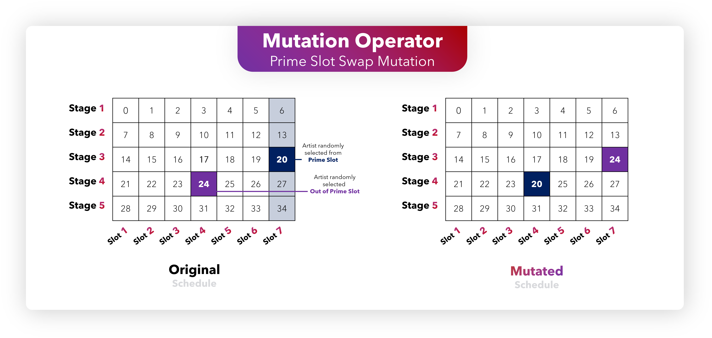
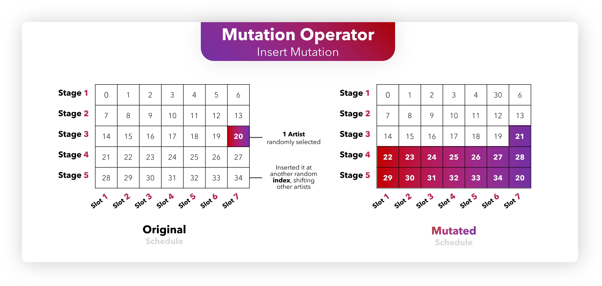
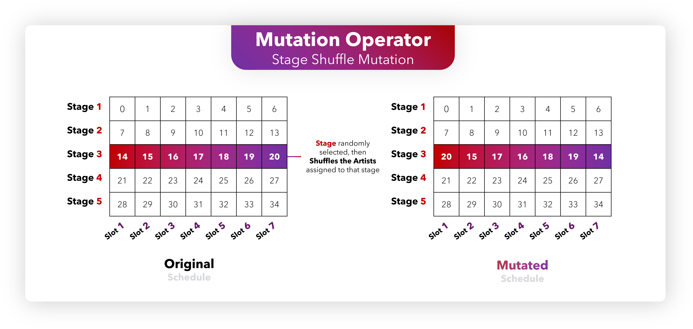
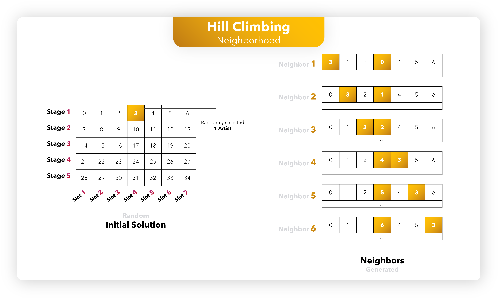
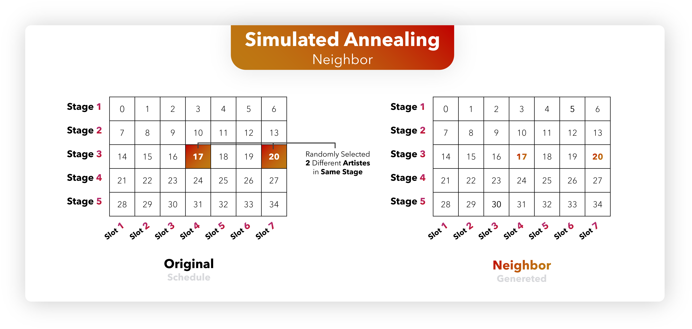

# 🎶 Music Festival Lineup Optimization using Genetic Algorithms 🎤🎸

Work developed for the **Computational Intelligence for Optimization (CIFO)** course in the **Master's in Data Science and Advanced Analytics** at **NOVA IMS** (Spring Semester 2024-2025).

<p align="center">
    <a href="https://github.com/Silvestre17/CIFO_Project_GroupW"> <!-- Make sure this link is correct -->
        
    </a>
</p>

## **📝 Description**

This project applies a **Genetic Algorithm (GA)** metaheuristic to tackle the **Music Festival Lineup Optimization problem**. The primary goal is to determine the optimal schedule for 35 artists across **5 stages** and **7 time slots**. The "optimal" lineup is defined by its ability to successfully balance three equally weighted criteria: maximizing prime-time slot popularity, maximizing simultaneous genre diversity, and minimizing scheduling conflicts due to overlapping fan bases.

## **✨ Objective**

The main objectives of this project are to:

-   **Develop a Genetic Algorithm** to find high-quality festival lineups.
-   **Maximize the popularity** of artists performing in prime time slots (the final slot on each stage).
-   **Maximize the diversity** of musical genres offered simultaneously across different stages within each time slot.
-   **Minimize scheduling conflicts** arising from artists with overlapping fan bases performing concurrently.
-   **Evaluate different GA configurations** (selection, crossover, mutation operators, elitism) to identify the most effective strategies.
-   **(Extra)** Compare the GA's performance against other optimization heuristics like **Hill Climbing** and **Simulated Annealing**.

## **📚 Context**

This project was undertaken as part of the **Computational Intelligence for Optimization (CIFO)** course in the Master's in Data Science and Advanced Analytics program at **NOVA IMS**. The problem statement and dataset were provided within the course, challenging us to apply and extend concepts learned in class to a complex optimization scenario.

**Dataset Source:** The project utilizes two primary CSV files:
*   `artists(in).csv`: Contains details for each of the 35 artists, including their unique name, primary music genre, and a popularity score (0-100).
*   `conflicts(in).csv`: A square matrix representing the degree of fan base conflict (0-1) between any two artists if they perform simultaneously.

## **🏗️ Project Structure**

The project follows a structured approach, guiding the process from understanding the problem to analyzing the results.

<p align="center">
    
</p>
<p align="center"><b>Figure 1:</b> Genetic Algorithm Flowchart.</p>

1.  **Problem Understanding & Definition:** 💡
    *   **Problem:** Schedule 35 unique artists into 35 slots (5 stages x 7 time slots) to optimize three conflicting objectives.
    *   **Objective Function:** A weighted sum of normalized scores for prime slot popularity, genre diversity, and conflict minimization (1 - normalized conflict). Weights are 1/3 for each.
    *   **Constraints:** Each artist assigned exactly once; no empty slots; all slots/stages uniform. Invalid solutions (duplicates, unassigned artists) are not permitted in the population.
        *   **Notebook Section:** `1. Problem Definition`


<p align="center">
    <a href="https://www.python.org/"></a>
    <a href="https://pandas.pydata.org/"></a>
    <a href="https://numpy.org/"></a>
</p>

2.  **Data Understanding & Preparation:** 🔍
    *   **Datasets:** `artists(in).csv`, `conflicts(in).csv`.
    *   **Key Attributes:** Artist genre, popularity, pairwise conflict scores.
    *   **Preprocessing:** Loaded data into Pandas DataFrames, converted `artists_df` to a dictionary (`artists_dict`) for efficient lookup, and transformed `conflicts_df` into a NumPy matrix (`conflict_matrix`) indexed by artist IDs.
        *   **Notebook Section:** `🧮 Import Databases`, `Data Preprocessing`

<p align="center">
    <a href="https://matplotlib.org/"></a>
    <a href="https://seaborn.pydata.org/"></a>
    <a href="https://plotly.com/python/"></a>
</p>

3.  **Genetic Algorithm Modeling:** 🧬
    *   **Solution Representation (`LineupSolution` class):** A 2D NumPy array (NUM_STAGES x NUM_SLOTS) where each cell contains a unique artist ID. This directly maps to the festival schedule.
    
    <p align="center">
        
    </p>
    
    **Code Schema:**
    <p align="center">
        
    </p>

    *   **Fitness Function:** Implemented within `LineupSolution`, calculating the weighted sum of:
        *   Normalized Prime Slot Popularity: `_calculate_normalized_popularity()`
        *   Normalized Genre Diversity: `_calculate_normalized_diversity()`
        *   Normalized Conflict Penalty (used as 1 - penalty): `_calculate_normalized_conflict()`
    
    <p align="center">
        
    </p>

    *   **Genetic Operators (New/Adapted):**
        *   **Selection:**
            *   `tournament_selection`: Selects the best individual from a random subset.
            *   `rank_selection`: Assigns selection probability based on rank.
        *   **Crossover:**
            *   `cycle_crossover (CX)`: Preserves absolute positions from parents.
            
            <p align="center">
                
            </p>

            *   `order_crossover (OX)`: Preserves relative order from a segment of one parent.
            
            <p align="center">
                

        *   **Mutation:**
            *   `prime_slot_swap_mutation`: Swaps an artist in a prime slot with another non-prime artist on the same stage.
            
            <p align="center">
                
            </p>

            *   `insert_mutation`: Moves an artist from one position to another, shifting others.
            
            <p align="center">
                
            </p>

            *   `stage_shuffle_mutation`: Shuffles all artists within a randomly selected stage.
            
            <p align="center">
                
            </p>

    *   **Elitism:** Implemented and tested (True/False) to carry over the best individual(s) to the next generation.
        *   **Notebook Sections:** `1. Solution Representation`, `2. Fitness Function`, `3. Implement New Genetic Operators`
        *   **Code Modules:** `library/lineupsolution.py`, `library/genetic_algorithms/` (selection, crossover, mutation modules)

4.  **Experimentation & Evaluation:** 📊
    *   **Grid Search:** Systematically tested 2 selection x 2 crossover x 3 mutation operators x 2 elitism settings (24 configurations total).
    *   **Parameters:** `POPULATION_SIZE = 100`, `MAX_GENERATIONS = 100`, `XO_PROBABILITY = 0.9`, `MUT_PROBABILITY = 0.2`, `TOURNAMENT_SIZE = 50`, `NUM_RUNS = 30` (for statistical significance).
    *   **Metrics:** Best fitness achieved, median fitness per generation, standard deviation of fitness.
    *   **Analysis:**
        *   Identified overall best-performing configurations.
        *   Analyzed the impact of different selection, crossover, and mutation methods on convergence and solution quality.
        *   Assessed the effect of elitism.
    *   **Statistical Tests:** Kruskal-Wallis and Dunn's post-hoc tests (or Mann-Whitney U for pairwise) to compare configurations and algorithms.
    *   **Visualization:** Evolutionary trend plots (median fitness ± std dev vs. generation), boxplots of final fitness distributions, 3D scatter plot for objective trade-offs.
        *   **Notebook Sections:** `4. Genetic Algorithm Execution (Grid Search)`, `5. Results Processing and Saving`, `7. Performance Analysis and Visualization`

5.  **Comparative Analysis (Optional):** ⚔️
    *   **Hill Climbing (HC):** Implemented and tested as a local search baseline. Explores neighbors by swapping artists within the same stage.
    
    <p align="center">
        
    </p>

    *   **Simulated Annealing (SA):** Implemented and tested as a probabilistic metaheuristic. Explores neighbors by swapping artists within the same stage, with a temperature-controlled acceptance of worse solutions.
    
    <p align="center">
        
    </p>

    *   **Comparison:** Compared the best GA configuration's performance against HC and SA based on final solution quality over multiple runs.
        *   **Notebook Section:** `9. Optional: Comparison with Hill Climbing and Simulated Annealing`

6.  **Deliverables:** 📤
    *   **Code Implementation:** This GitHub repository containing all Python scripts and Jupyter Notebooks.
        *   **Main Notebook:** `MusicLineupOptimization_CIFOProject_GroupW.ipynb`
        *   **Core Logic:** Files within the `library/` directory.
    *   **Report:** A PDF document detailing the problem, methodology, experiments, results, and conclusions.
    *   **Results:** Saved experiments in `./Results/` and plots in `./Results/Plots/`.

## 🛠️ Technologies & Libraries

<p align="center">
    <a href="https://www.python.org/"></a>
    <a href="https://pandas.pydata.org/"></a>
    <a href="https://numpy.org/"></a>
    <a href="https://matplotlib.org/"></a>
    <a href="https://seaborn.pydata.org/"></a>
    <a href="https://plotly.com/python/"></a>
    <a href="https://docs.scipy.org/doc/scipy/reference/stats.html"></a>
    <a href="https://scikit-posthocs.readthedocs.io/"></a>
</p>

## 📈 Key Results


-   **Best Performing GA Configuration (Overall Peak Fitness):** `Rank & Cycle & Stage Shuffle & Elitism=False` (Fitness: ~0.8801).
-   **Best Performing GA Configuration (Median Final Fitness):** `Rank & Cycle & Stage Shuffle & Elitism=True` (Median Fitness at Gen 100: ~0.8573 ± 0.0065).
-   **Operator Impact:**
    *   **Crossover:** `Cycle` crossover variants generally led to higher median fitness than `Order` crossover.
    *   **Mutation:** `Stage Shuffle` mutation often featured in top configurations, suggesting its effectiveness in exploring diverse schedule arrangements.
    *   **Selection:** `Rank` selection paired with `Cycle` crossover was a consistently strong combination. `Tournament` selection also yielded competitive results, especially with `Cycle` crossover.
-   **Elitism:** Generally beneficial, helping to preserve the best solutions found and often leading to slightly higher median fitness values in later generations, though configurations without elitism also achieved top peak fitness.
-   **Comparison with Other Heuristics:**
    *   The best GA configurations significantly outperformed Hill Climbing.
    *   The best GA configurations performed comparably to Simulated Annealing, with no statistically significant difference in their final median fitness distributions.

## 📚 Conclusion & Future Work

This project successfully demonstrated the application of Genetic Algorithms to the complex, multi-objective problem of music festival lineup optimization. The implemented GA, with carefully chosen operators and parameters, was able to find high-quality solutions that effectively balance artist popularity, genre diversity, and fan conflicts.

**Future Work could explore:**
*   More sophisticated multi-objective optimization techniques
*   Adaptive parameter tuning for GA operators.
*   Hybrid approaches combining GA with local search methods.
*   A hyperparameter optimization for Simulated Annealing ($C$, $L$, $T$) to improve its performance.

Feel free to explore the `MusicLineupOptimization_CIFOProject_GroupW.ipynb` notebook for detailed implementation, experimentation, and analysis!

<br>

### 👥 Team (Group W)

-   André Silvestre, 20240502
-   Filipa Pereira, 20240509
-   Umeima Mahomed, 20240543

<br>

## **📂 Repository Structure**

```plaintext
.
├── MusicLineupOptimization_CIFOProject_GroupW.ipynb  # Main Jupyter Notebook with all analysis
├── data/
│   └── 3_MusicFestivalLineup/
│       ├── artists(in).csv
│       └── conflicts(in).csv
├── library/                                          # Core logic for the GA and other algorithms
│   ├── __init__.py
│   ├── lineupsolution.py                             # Solution representation and fitness
│   ├── genetic_algorithms/
│   │   ├── __init__.py
│   │   ├── algorithm.py                              # GA main loop components
│   │   ├── crossover.py                              # Crossover operators
│   │   ├── mutation.py                               # Mutation operators
│   │   └── selection.py                              # Selection mechanisms
│   ├── hill_climbing.py
│   └── simulated_annealing.py
├── Results/
│   ├── GA_GridSearchResults_MusicFestivalLineup.csv  # Saved raw results from grid search
│   └── Plots/                                        # Saved visualizations
│       ├── Top5_ConfigurationsEvolutionaryTrend.png
│       └── ... (other generated plots)
├── ReportSchemas/                                    # Report schemas and flowcharts
└── README.md                                         # This file
```
